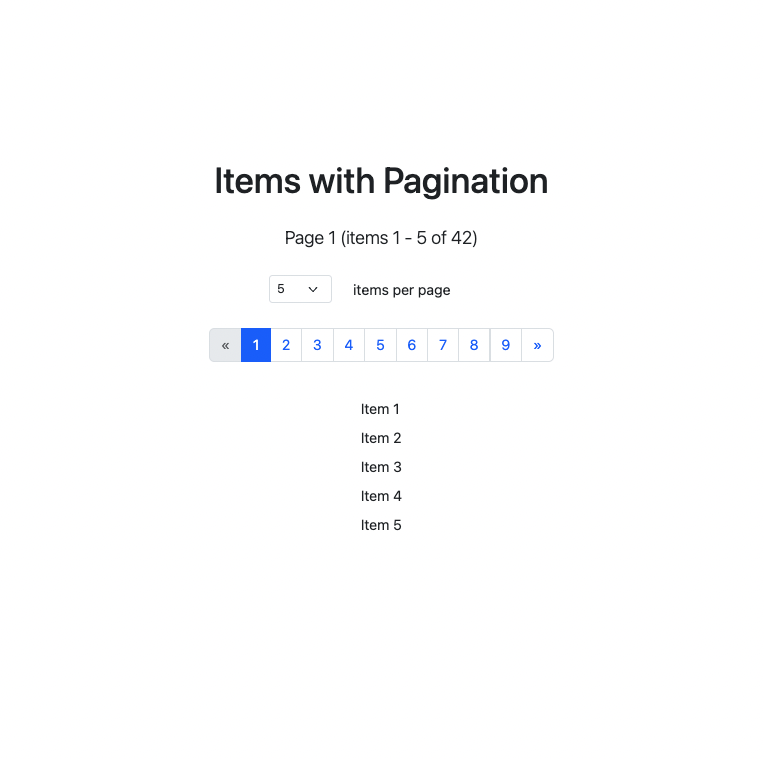
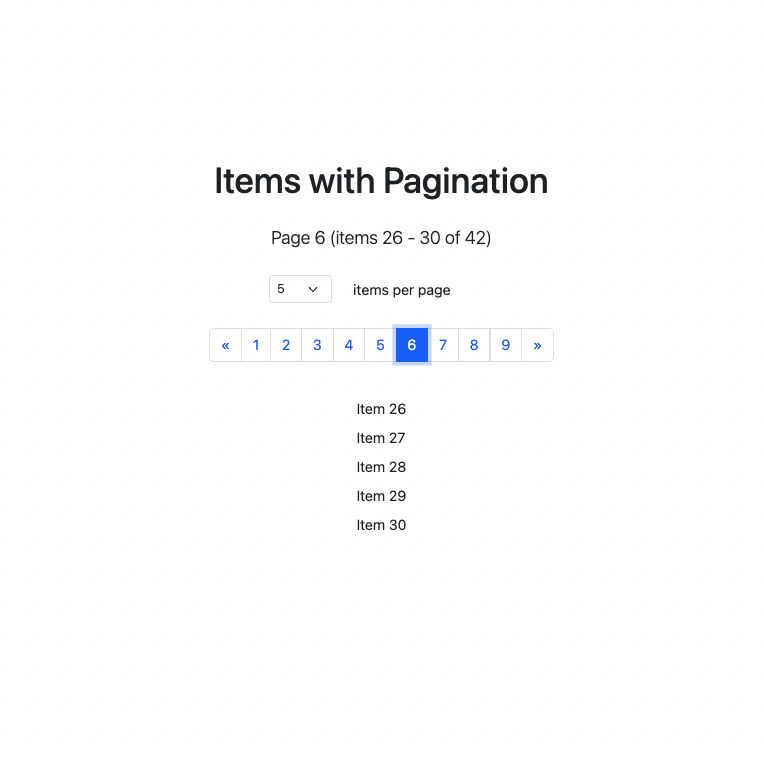
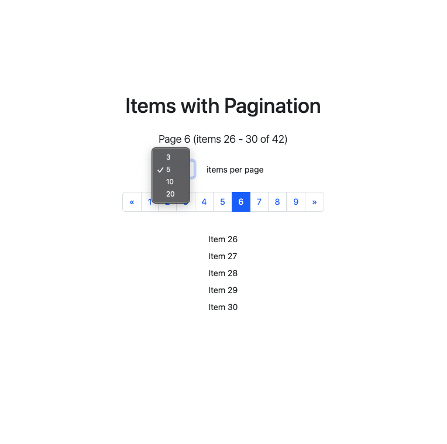

# Items Pagination

A modern React application for displaying and managing items with customizable pagination controls.

## 📸 Screenshots

<div align="center">
  
  <p><em>Main view with items list and pagination controls</em></p>
  
  
  <p><em>Pagination controls with page navigation</em></p>
  
  
  <p><em>Customizing items per page</em></p>
</div>

## 🌟 Features

- **Customizable Pagination**

  - Adjust number of items per page (3, 5, 10, 20)
  - Navigate through pages with intuitive controls
  - Display current page and item range
  - Responsive pagination component

- **Modern UI**

  - Clean and intuitive interface using Bootstrap 5
  - Responsive design for all screen sizes
  - Clear visual feedback for current page
  - Smooth transitions between pages

- **TypeScript Integration**
  - Strongly typed components and functions
  - Custom hooks for state management
  - Type-safe pagination logic

## 🛠️ Tech Stack

- React 19
- TypeScript
- Vite
- Bootstrap 5
- ESLint
- GitHub Pages

## 📦 Project Structure

```
src/
├── components/
│   └── Pagination/     # Pagination component with controls
├── utils/             # Utility functions and data
├── App.tsx           # Main application component
└── main.tsx          # Application entry point
```

## 🔍 Usage

1. **Items Per Page**

   - Select desired number of items from dropdown
   - Options: 3, 5, 10, or 20 items per page
   - Changes automatically reset to first page

2. **Page Navigation**

   - Use pagination controls to move between pages
   - First and last page buttons for quick navigation
   - Previous and next buttons for sequential navigation
   - Current page is highlighted

## 🎯 Live Demo

Check out the live version at: [https://Artem-Brui.github.io/Items-Pagination/](https://Artem-Brui.github.io/Items-Pagination/)

## 🚀 Getting Started

### Prerequisites

- Node.js (v14 or higher)
- npm (v6 or higher)

### Installation

1. Clone the repository:

```bash
git clone https://github.com/your-username/Items-Pagination.git
cd Items-Pagination
```

2. Install dependencies:

```bash
npm install
```

3. Start the development server:

```bash
npm run dev
```

The application will be available at `http://localhost:5173`

### Building for Production

To create a production build:

```bash
npm run build
```

### Deployment

The application can be deployed to GitHub Pages. To deploy manually:

```bash
npm run deploy
```

## License

MIT
